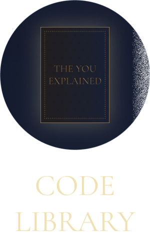

# Visual QA — Frame 654

**Figma:** https://www.figma.com/design/xn6MdQV0gGGeedaFtHWWCo/Dev-Master-File?node-id=7227-5881&m=dev
**File:** `xn6MdQV0gGGeedaFtHWWCo`
**Node:** `7227:5881`
**Pulled:** 2026-05-28T22:29:53.693Z

## Reference

## Component instances in this node

_(no published components in this node)_

## Top-level dimensions

- Width: 100
- Height: 160
- Layout: VERTICAL

## Review checklist

- [ ] Tokens match (colors, type, spacing) — diff against `src/theme/generated/tokens.ts`
- [ ] Component instances above all have a `.figma.tsx` Code Connect file
- [ ] Layout mode and padding match the layout container in code
- [ ] Corner radii match `figmaSpacingRadius` tokens
- [ ] Text content matches (copy review)
- [ ] Side-by-side screenshot of the rendered RN screen attached below

## Rendered (RN)

_Capture the rendered screen and save as `./code-library-icon-frame/code-library-icon-frame-rn.png` then reference it below:_

<!--  -->

## Notes

_Add diff observations here._
