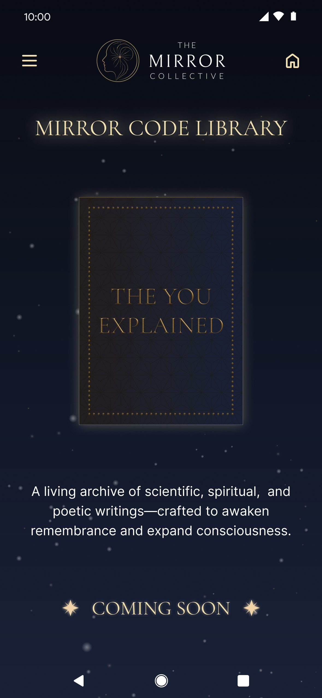

# Visual QA — Mirror Code Library Coming Soon

**Figma:** https://www.figma.com/design/xn6MdQV0gGGeedaFtHWWCo/Dev-Master-File?node-id=2399-4213&m=dev
**File:** `xn6MdQV0gGGeedaFtHWWCo`
**Node:** `2399:4213`
**Pulled:** 2026-05-28T23:08:57.089Z

## Reference

## Component instances in this node

- `Frame 382` (d890e52d962ec6795355974d3aeae597f977cad1)
- `dehaze` (ac38cac63e81778304f5bace20e519dc5db13cd4)
- `Property 1=false` (017ba1d4918c9fbd80186804609747ce965f1073)

## Top-level dimensions

- Width: 393
- Height: 852
- Layout: static

## Review checklist

- [ ] Tokens match (colors, type, spacing) — diff against `src/theme/generated/tokens.ts`
- [ ] Component instances above all have a `.figma.tsx` Code Connect file
- [ ] Layout mode and padding match the layout container in code
- [ ] Corner radii match `figmaSpacingRadius` tokens
- [ ] Text content matches (copy review)
- [ ] Side-by-side screenshot of the rendered RN screen attached below

## Rendered (RN)

_Capture the rendered screen and save as `./mcl-coming-soon/mcl-coming-soon-rn.png` then reference it below:_

<!--  -->

## Notes

_Add diff observations here._
