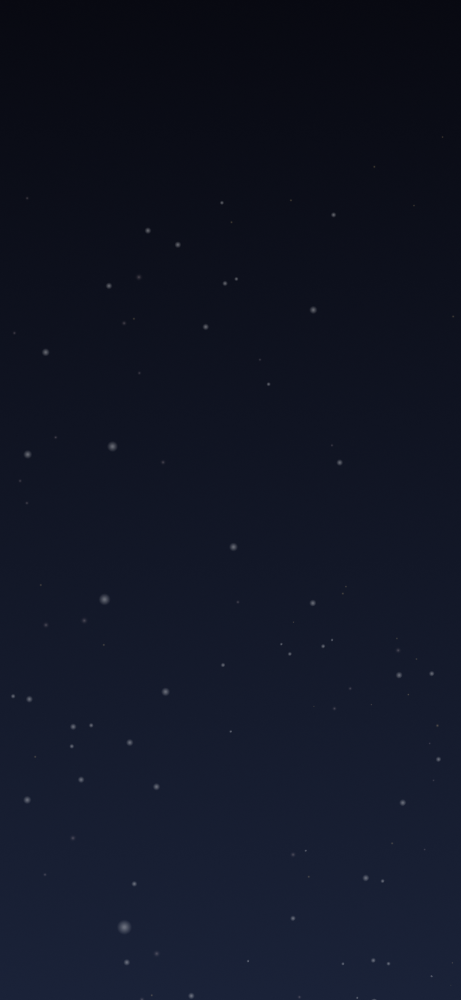

# Visual QA — Home Screen (Talk to Mirror)

**Figma:** https://www.figma.com/design/CKupz8fZOJEx3IQyUsm4ia/Design-Master-File?node-id=4326-2276
**Node:** `4326:2276` (Home Screen - FINAL)
**Pulled:** 2026-04-26
**Code:** `src/screens/TalkToMirrorScreen.tsx`

## Reference



## Layout (Figma → code)

| Figma node | Section | Code element |
| --- | --- | --- |
| 4326:2301 | Outer column (h:654, justify-between) | `styles.content` |
| 4326:2302 | Greeting row (avatar + name) | `styles.greetingRow` |
| 4326:2303 | Avatar 50×50 gold ring | `styles.avatarRing` |
| 4326:2305 | Welcome text 28px Cormorant Light Italic | `styles.greeting` |
| 4326:2306 | Oval mirror 183×275 | `<OvalMirror />` |
| 4326:2332 | Talk button row (gap:16, stars + pill) | `styles.talkRow` |
| 4407:2755 | Pill button (border 0.5 navy.light, radius 16) | `styles.talkButton` |
| 4326:2337 | Horizontal category scroll | `<ScrollView horizontal>` |
| 4326:2339-2393 | 4 category cards | `<CategoryCard />` × 4 |

## Tokens used

| Figma variable | Code token |
| --- | --- |
| Bg/Brand, Border/Brand, Text/Paragraph-1, Icon/Brand (#f2e1b0) | `palette.gold.DEFAULT` (#f2e2b1 — Δ 1) |
| Border/Subtle (#a3b3cc) | `palette.navy.light` |
| Bg/Brand Hover (#f0d4a8) | `palette.gold.glow` |
| Spacing/M (16) | `spacing.m` |
| Spacing/S (12) | `spacing.s` |
| Radius/M (16) | `radius.m` |
| font/family/Heading | `fontFamily.heading` (Cormorant Garamond) |
| font/size/L (20) | hard-coded `moderateScale(20)` (no token) |
| font/size/XL (24) | hard-coded `moderateScale(24)` (no token) |
| font/size/2XL (28) | hard-coded `moderateScale(28)` (no token) |
| Glow Drop Shadow | `textShadow.glowSubtle`, `palette.gold.glow` shadow on Views |

**Token gap:** Figma `font/size/L|XL|2XL` (20/24/28) aren't in `src/theme/tokens.ts`'s `fontSize` scale (which has `lg:18, xl:20, '2xl':24, '3xl':32`). The 28px size is missing entirely. Follow-up: add `xxl:28` to fontSize.

## Asset inventory

Located in `src/assets/talk-to-mirror/`:

| File | Type | Source (Figma) | Used for |
| --- | --- | --- | --- |
| `user-avatar.png` | raster | imgImage1 | Greeting row avatar |
| `oval-mirror.svg` | vector | node 4326:2306 | Mirror centerpiece (rim + cream gradient + glow, all baked in) |
| `icon-mirror-echo.svg` | vector | node 4326:2340 (Component 14) | Mirror Echo full-circle icon |
| `icon-reflection-room.svg` | vector | node 4326:2345 (Component 15) | Reflection Room full-circle icon |
| `icon-code-library.svg` | vector | node 4326:2362 (Component 16) | Code Library full-circle icon |

**Asset rule applied:** every category SVG is a self-contained 100×100 with its own ring stroke (`#9BAAC2` = `palette.navy.light`) and translucent fill — so the screen renders them at `width=ICON_RING height=ICON_RING` with no wrapping border View. The mirror SVG is similarly self-contained at 183×275 with rim + glow inside.

**Discarded raster assets** (replaced by the SVGs above):
- `oval-mirror-fill.png` (had been the 1910×2902 portrait — replaced by `oval-mirror.svg`)
- `oval-mirror-overlay.png` (the wide 3981×1691 panorama — was a misidentified texture source)
- `icon-mirror-echo.png`, `icon-code-library-{cover,pages,text}.png` (4 PNGs replaced by 2 SVGs)

## Asset gaps (TODO)

1. **Mirror Pledge icon** — Figma source (4326:2384 / `imgGroup14`) renders blank in MCP `get_screenshot` due to its clip-path structure, and the user-provided SVG export didn't include it. Currently approximated by `src/components/icons/MirrorPledgeIcon.tsx` — full-circle 100×100 SVG matching the visual style of the other category icons (translucent fill + navy.light ring stroke + gold pledge motif inside). Replace with the exported asset once available.

**To fix:** export Component 17 (or whatever the Mirror Pledge component is named) from Figma the same way the other three were provided, drop into `src/assets/talk-to-mirror/icon-mirror-pledge.svg`, swap in the import.

## Lessons learned (codified into CLAUDE.md)

- **Hash-named PNGs from MCP need to be matched by aspect ratio, not just by export order.** I initially labelled the 3981×1691 wide panorama as `oval-mirror-fill.png` because it appeared first in the imports list — but the aspect ratio (2.35:1) was wildly wrong for a portrait mirror (0.66:1). Always verify aspect ratio against the target frame's dimensions before naming.
- **Don't set `backgroundColor` on bordered ring containers** when the design intends the parent's starfield to show through.
- **Prefer SVG over PNG when the Figma asset is vector.** Once the user provided the SVG exports, the entire ring + content stack collapsed from "navy.deep View + gold border + PNG image inside" (which mismatched the design) to a single self-contained `<IconMirrorEcho />` component. Less code, exact match. Ask for vector exports first, drop to PNG only when the asset is genuinely raster (photo, gradient texture).

## Review checklist

- [x] Header (hamburger / logo / home) — reuses existing `LogoHeader`
- [x] Greeting row layout (avatar left, italic text right, gap 16)
- [x] Oval mirror dimensions (183×275, gold rim + glow)
- [x] Talk button bordered pill with gradient bg, stars flanking
- [x] Horizontal scroll with 4 category cards (100×100 ring + label)
- [x] Tokens match (within Δ1 on the gold)
- [x] Tests updated and passing (6/6)
- [ ] **RN screenshot captured** — drop at `./talk-to-mirror/talk-to-mirror-rn.png` after running on device
- [ ] Side-by-side diff annotated with deltas

## Rendered (RN)

_Capture after running the app:_

```
npm run ios   # or npm run android
# Navigate to TalkToMirror screen, take screenshot, save as below
```

<!--  -->

## Notes

- The oval mirror rim is currently a single-color View border. The Figma source has subtle gradient lighting on the rim that we don't capture without the exported SVG.
- The avatar PNG (`user-avatar.png`) is 19MB at 2734×4096 — way too large for an avatar. **Recommend** running through ImageOptim or `pngquant` before merging; target ~50KB at 150×150 @3x.
